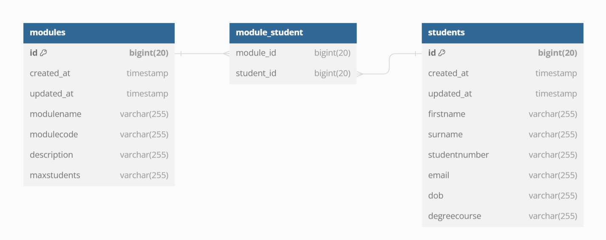

# Tasks
If **everyone in your team** has followed the [setup instructions](./LocalDevSetup.md) and can successfully access the project's home page on their own device, you're now ready to start coding! 

The project's [README](../README.md) has a list of [tasks still left to finish in the current sprint (sprint 2)](../README.md#current-sprint---sprint-2) and a list of [known issues that must be fixed](../README.md#🐛-bugs-and-known-issues).

Your team will have to work together to complete the development tasks.

> [!Important]
> Even if you don't have time to work on the development tasks in today's session, it's important that you understand what the tasks ask you to do and what order they can be completed in.
>
> Prioritise the team tasks (Task 1 and Task 2).
> These tasks, bugs and project management decisions are very common, and it is likely you will encounter at least some of them while working on your coursework.


# Task List
## :busts_in_silhouette: Team Tasks
- [Task 1 (TEAM): Understand and comment the project code](#👥-task-1-team-understand-and-comment-the-project-code)
- [Task 2 (TEAM): Project management](#👥-task-2-team-project-management)

## :bug: Bug fixes
- [Bug 1. students table missing the 'degreecourse' column](#🐛-1-students-table-missing-the-degreecourse-column)
- [Bug 2. modules table missing the 'description' column](#🐛-2-modules-table-missing-the-description-column)
- [Bug 3. studentlisting and studentprofile views do not display the degree course](#🐛-3-studentlisting-and-studentprofile-views-do-not-display-the-degree-course)
- [Bug 4. The studentlisting view does not display surnames](#🐛-4-the-studentlisting-view-does-not-display-surnames)
- [Bug 5. studentprofile view can't load, throws an error AND 6. moduledetails view can't load, throws an error](#🐛-5-studentprofile-view-cant-load-throws-an-error-and-6-moduledetails-view-cant-load-throws-an-error)
- [Bug 7. moduledetails view does not display a list of enrolled students](#🐛-7-moduledetails-view-does-not-display-a-list-of-enrolled-students)
- [Bug 8. moduledetails view does not display the module description](#🐛-8-moduledetails-view-does-not-display-the-module-description)
- [Bug 9. modulelisting view does not display the number of enrolled students](#🐛-9-modulelisting-view-does-not-display-the-number-of-enrolled-students)


# :busts_in_silhouette: Team Tasks
## :busts_in_silhouette: Task 1 (TEAM): Understand and comment the project code 
- Your team is jumping into an existing project, and the only documentation you've been given is a simple entity relationship diagram (see below).
- Without documentation, the only way to understand the codebase is to read through all of it.
- To make this easier, you will each comment at least one class (list provided below) in detail, and then push the commented file to the repository.
- This way, the rest of the team can quickly scan your comments to understand what's going on!

###  Step 1: Understand the Entity relationship diagram (ERM)


1. Read through the ERM together
2. Discuss what each table represents
3. Identify the primary keys and any foreign keys
4. Discuss what the relationships between the tables are

### Step 2: Decide how to collaborate
You will all need to push at least one commented file to git (from your own account!).
1. Discuss as a team how you will handle this - e.g., will you use branches?

### Step 3: Assign files
- Everyone in the team should select at least one file (or group of files) from the list. 
- Some files are shorter, so have been grouped together. 
- Make sure that all files are commented (even if you have less team-members than files).
```
1. /app/Models/Student.php AND /app/http/Controllers/StudentController.php AND app/routes/web.php
2. /app/resources/views/studentlisting.blade.php
3. /app/resources/views/studentprofile.blade.php
5. /app/database/migrations/2023_10_26_181714_create_students_table.php
6. /app/database/migrations/2023_10_26_194752_create_modules_table.php
7. /app/database/migrations/2023_10_26_200443_add_optional_to_modules
8. 2023_10_30_163344_create_module_student_table.phpp
9. /app/database/seeders/DatabaseSeeder.php AND /app/database/seeders/StudentSeeder.php
10./app/database/factories/StudentFactory.php
```
>
If there are more team members present than available files, you can also select one of the following:
```
1. /app/Models/Module.php AND /app/http/Controllers/ModuleController.php 
2. /app/database/seeders/ModuleSeeder.php
```

### Step 4: Comment your file(s)
- Follow the prompts in the files to comment your code.
- Some will require you to do some research to understand what's going on.
- Add any extra detail you think is relevant or would help others understand the code.
- Talk with your team-mates as you do this! Some files interact closely with others.

> [!CAUTION]
> Remember that this project is very early in its development, which means that some files may be unfinished or contain bugs!
>
> **Do not fix these yet!**. 
>
> If you spot something you feel is incorrect, may cause an error, or is missing information (see the [backlog](../README.md#🏃-sprint-2-in-progress) and [list of known bugs](../README.md#known-issues)), just leave a comment explaining what you think is wrong.

### Step 5: Commit code and push to Git
- Share your finished comments with the rest of your team by committing and pushing them to the repository.
- If you have finished before others, ask if anyone would like to pair program on their file, or select another file from the list.

### Step 6: Discuss and compare
- It's important that everyone in your team understands the project code.
- After all of the files have comments, every team member should then `pull` the latest version of the repository
- This way, everyone has access to all the commented files
- Talk through your comments, and make sure that everyone has a good understanding of the project. Can you identify any bugs, or where missing features may be added?
- Take a look at some of the other project files (for example, `/app/database/seeders/ModuleSeeder.php`) and see if and how they differ.

[Back to task list](#task-list)
## :busts_in_silhouette: Task 2 (TEAM): Project management
### Step 1: Task order
- As a team, read through the backlog and bug-fixes.
    - Some of these tasks can be completed simultaneously
    - Some tasks require others to be completed befre they can be started
- Try to identify which category each task falls into

### Step 2: Github
- Decide how you will collaborate on GitHub based on your decisions in Step 1 (i.e. what branching structure will you use?)

### Step 3: Assign tasks
- You can work individually or in pairs. Each individual or pair should pick one task to work on.
- If you have trouble, ask for help! First from your team, then from the teaching staff. Make use of agile techniques such as pair programming.
- Even if you don't finish a task by the end of the workshop, push what you've done to git with an appropriate commit message. It's important to push regularly, not just when you've finished something!

[Back to task list](#task-list)


# :bug: Bug fixes

> See [Known Issues](../README.md#🐛-bugs-and-known-issues)

## :bug: 1. students table missing the 'degreecourse' column

1. Create a migration to update the existing `student` table and add the new column
2. Update `/app/database/factories/StudentFactory.php` to include this information in the seed data.
    - The course must be selected from an array of coursenames (e.g. [`BSc Computer Science`, `BSc Cybersecurity`]) that you will need to define
    - The course must be randomly selected for each student

> [!TIP]
> The Faker documentation contains a list of useful formatters [https://fakerphp.github.io/formatters/](https://fakerphp.github.io/formatters/numbers-and-strings/)


[Back to task list](#task-list)


## :bug: 2. modules table missing the 'description' column
1. Create a migration to update the existing `module` table and add the new column
2. Update `/app/database/seeders/ModuleSeeder.php` to include this information in the seed data.

[Back to task list](#task-list)


## :bug: 3. studentlisting and studentprofile views do not display the degree course
1. Update the studentprofile view to display the degree course of the selected student
1. Update the studentlisting view to display students' degree course


[Back to task list](#task-list)

## :bug: 4. The studentlisting view does not display surnames
1. Investigate the cause
2. Fix the issue


[Back to task list](#task-list)


## :bug: 5. studentprofile view returns a 404 error
1. Investigate the cause
2. Fix the issue

> [!TIP]
> The studentprofile view is a dynamic route, and needs to know which student to display.
> Think about where this information comes from, and how it is passed to the view.

## :bug: 6. ModuleSeeder.php throws an error
1. The section of code that throws the error is commented out. It is supposed to assign students to modules.
2. The previous developer has left a note in a comment explaining what they think the issue is. [Read the comment](../app/database/seeders/ModuleSeeder.php) to see where to start
3. Investigate the cause
4. Update the project code based on your findings
5. Try uncommenting the code and running the seeder again. Does it work?

> [!TIP]
> Take a look at the [Laravel documentation on many-to-many relationships](https://laravel.com/docs/10.x/eloquent-relationships#many-to-many)

[Back to task list](#task-list)


## :bug: 7. moduledetails view does not display a list of enrolled students
1. Display a list of students enrolled in the module
2. The list should contain the student number, student surname, and student first name
3. The user should be able to click on the student number and be taken to the student's studentprofile page

[Back to task list](#task-list)


## :bug: 8. moduledetails view does not display the module description
1. Include the module description in the moduledetails view


[Back to task list](#task-list)


## :bug: 9. modulelisting view does not display the number of enrolled students
1. Display the number of students enrolled in each module in the table
    - remember that this is a many-to-many relationship!

[Back to task list](#task-list)


